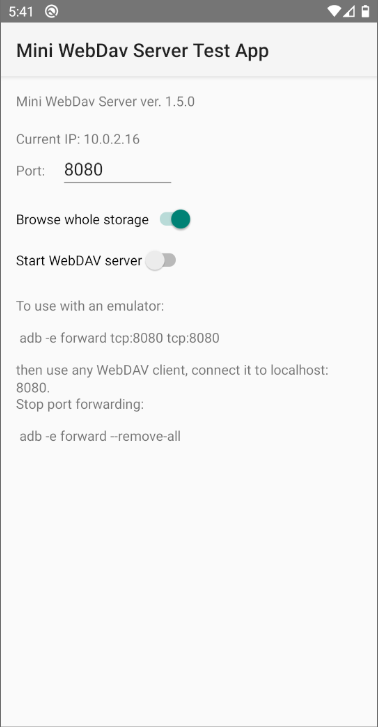

# Mini WebDAV Server for Android

I originally cloned this from https://github.com/erspicu/Baxermux.server.http, however there
was so much to change, fix, enhance, that I finally created a new Android app project, copied
code fragments from Baxermux and continued from there.

Why I needed it: in Android 11 and higher the app private directories under 

    /sdcard/Android/data/package.name.com/files

are so "secure", that noting can access them. When I debug my apps, I often need to manage files
there, create new ones, delete etc. On a physical device it's possible to connect with a USB cable
and manage the files with host file explorer, however in Android emulators, at least at the time
of this writing (Jan. 2021) all I get is "permission denied". No matter if I try to use adb shell,
the mediocre "Device File Explorer" in Android Studio, nothing permits file management there.
Another issue with the "Device File Explorer" in Android Studio is that it does not show hidden 
files and directories (with names starting with a dot), which I need to manage too.

Decided to resurrect this WebDAV server and make it a part of my app, at least in the DEBUG mode.
Now I can access these folders, using any WebDAV client. On my Windows development host I use the
excellent WebDrive product - it mounts the directory exported by the Mini WebDAV server as a
Windows virtual drive, and I can use the native Windows File Explorer, or command prompt, can view and
edit the files as if they were local to my computer.

The project contains WdServerLib library module, and a trivial test app. The app pulls the library 
via the build.gradle command:

    debugImplementation project(':WdServerLib')
    
therefore it does not need any extra permissions when built in RELEASE mode, it
pulls WdServerLib only when built in DEBUG mode. 

When run on Android 10 and lower with access to the full storage, the files and folders on an additional
SD card are read-only. They are read-wrie on Android 11 due to the new MANAGE_EXTERNAL_STORAGE permission,
available in Android 11. On Android 10 and lower managing files there would be possible with scoped
storage operations, after the user approves access to directories. Something to consider later.

## Adding to existing project from jippack

Add it in your root build.gradle at the end of repositories:

	allprojects {
		repositories {
			...
			maven { url 'https://jitpack.io' }
		}
	}

Add the dependency your own app's build gradle:

	dependencies {
	        debugImplementation 'com.github.gregko:Mini-WebDAV-server-for-Android:1.5.8'
	}

Then make yourself a discrete debug only button or menu item (or as I did - a long press action...)
to start the Mini WebDAV Server settings activity:

        Intent intent = new Intent();
        intent.setClassName(MainActivity.this,
                            "com.hyperionics.wdserverlib.ServerSettingsActivity");
        startActivity(intent);

That's all! Hope it will be useful to other developers as well. I don't recommend making a consumer product from
this - the security issues would need serious consideration. <b>If you use this project in any way, please send
me a note (email or post to Discussions area here, or at least star it) so that I would know it's worth maintaining...</b>

